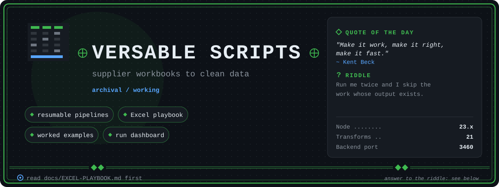

<p align="center">
  
</p>

<h1 align="center"> Versable Scripts</h1>

<p align="center">
  Working scripts for turning supplier product workbooks into clean, enhanced data.
</p>

<p align="center">
  
  
  
  
  
</p>

---

<details>
<summary>Riddle answer</summary>

An idempotent pipeline step: re-running a run folder skips any step whose output is already on disk.

</details>

## About

This is a working directory, not a product. It holds the pipeline engine, the transforms, and the one-off scripts behind several supplier data jobs: JEGS eBay, the cc30 runs, the Walmart loadsheets, and the AEP catalog. Most of it was written to solve one dataset and kept because the next dataset rhymes.

Two things make it worth reading rather than restarting. The `pipeline/` engine handles the boring parts of any config-driven, resumable, step-by-step transform. And several expensive lessons about Excel are written down instead of being rediscovered.

**If you are here for a new workbook task, read [`docs/EXCEL-PLAYBOOK.md`](docs/EXCEL-PLAYBOOK.md) first.** It covers which library to reach for, the order of operations that works, the traps this repo has actually hit, and what the enhancement-product upload path requires of a sheet.

## Quick start

```bash
npm install
./start-dev.sh          # backend on 3460, dashboard on 5173
cd ui && npm run check  # type check
```

## Running a pipeline

Each run is a folder under `runs/` with a `run.config.js` naming its input, its step sequence, and its outputs. Steps are idempotent: re-running skips work whose output already exists.

```bash
node pipeline/run.js runs/jegs-mar-07                        # full run
node pipeline/run.js runs/jegs-mar-17 --from clean-attributes
node pipeline/run.js runs/jegs-mar-17 --step normalize
node pipeline/run.js runs/jegs-mar-17 --limit 3              # sample first, always
```

Data flows `raw.json` → `step1.json` → `step2.json` → `final.json` inside the run's `data/`. A transform is `{ meta, run(items, config, ctx) }`, and its JSDoc header is parsed by the server for UI metadata.

## One-off workbook projects

A job that is not a pipeline run gets its own top-level folder in the same shape:

```
<project>/
├── input/    output/    data/
├── docs/     PLAN.md and whatever the job needed written down
└── scripts/  01-…, 02-… numbered steps; _-prefixed exploratory probes
```

[`aep-catalog-v9/`](aep-catalog-v9/) is the worked example to copy: probe the workbook, analyse the joins, build, validate against the source, then check the result loads in the target system. Its [`README`](aep-catalog-v9/README.md) and [`PLAN`](aep-catalog-v9/docs/PLAN.md) show the shape. `walmart-q2-phase1/` and `walmart-vf/` are earlier ones.

## Layout

| Path | What lives there |
| --- | --- |
| `pipeline/` | the engine: `engine.js`, `run.js`, `io.js`, `manifest.js`, `job-queue.js`, `logger.js` |
| `transforms/` | 21 pipeline steps: normalize, enhance-content, extract-attributes, the cc30 family |
| `runs/<run-id>/` | per-run config, data, logs, posters |
| `ui/` | SvelteKit dashboard for running and inspecting pipelines |
| `server.js` | single-file Express backend on 3460, in-memory queue, 2 concurrent jobs |
| `dashboards/` | standalone review dashboards, served as plugins |
| `aep-catalog-v9/` | AEP catalog flattening, the current worked example |
| `walmart-q2-phase1/`, `walmart-vf/` | earlier one-off projects |
| `parse-excel/` | legacy Python xlsx converter |
| `archive/` | superseded one-offs, kept for reference |

## Documentation

| Document | What it covers |
| --- | --- |
| [`docs/EXCEL-PLAYBOOK.md`](docs/EXCEL-PLAYBOOK.md) | **Start here for a workbook task.** Tooling, order of operations, the traps, the enhancement-product ingest contract, how to verify without fooling yourself |
| [`CLAUDE.md`](CLAUDE.md) | project conventions and the critical rules an agent must follow here |
| [`SYSTEM-DESIGN.md`](SYSTEM-DESIGN.md) | pipeline architecture |
| [`TECH-STACK.md`](TECH-STACK.md) | what is used and why |
| [`DEPLOY.md`](DEPLOY.md), [`DEPLOYMENT-STRATEGY.md`](DEPLOYMENT-STRATEGY.md) | deployment |
| [`aep-catalog-v9/docs/PLAN.md`](aep-catalog-v9/docs/PLAN.md) | a worked example of measuring a workbook before transforming it |
| [`_cc30-runbook.md`](_cc30-runbook.md) | the cc30 run, start to finish |
| [`jegs-final-rerun-plan.md`](jegs-final-rerun-plan.md) | the JEGS final rerun |
| [`sse-event-race-condition.md`](sse-event-race-condition.md) | a server-sent-events bug worth not repeating |
| [`.claude/skills/runtime-notes.md`](.claude/skills/runtime-notes.md) | per-session findings from earlier work |

## The rules that keep biting

Fuller versions live in [`CLAUDE.md`](CLAUDE.md) and the playbook, but these four cause the most damage:

1. **Sample 2 or 3 rows and print every field with its type** before any full run.
2. **Read exports back off disk.** A successful write is not a correct file.
3. **32,767 characters per cell.** Assert it rather than assuming.
4. **A checker that shares helpers with the builder is not a checker.** It recomputes the expected answer with the same bug. Rebuild the expectation from the raw grid, and mutation-test the checker.

## Known issues

- Poster download can hang: the server generates the image and logs "Image ready", but the response never reaches the client on real payloads.
- 119 items lose images when Main Image is None; the fallback to pipe-separated images is not wired everywhere.
- `ui/src/routes/runs/` has empty directories where four page files were deleted, while `+layout.svelte` and `api.ts` still link to `/runs`. Unfinished, not intended.
